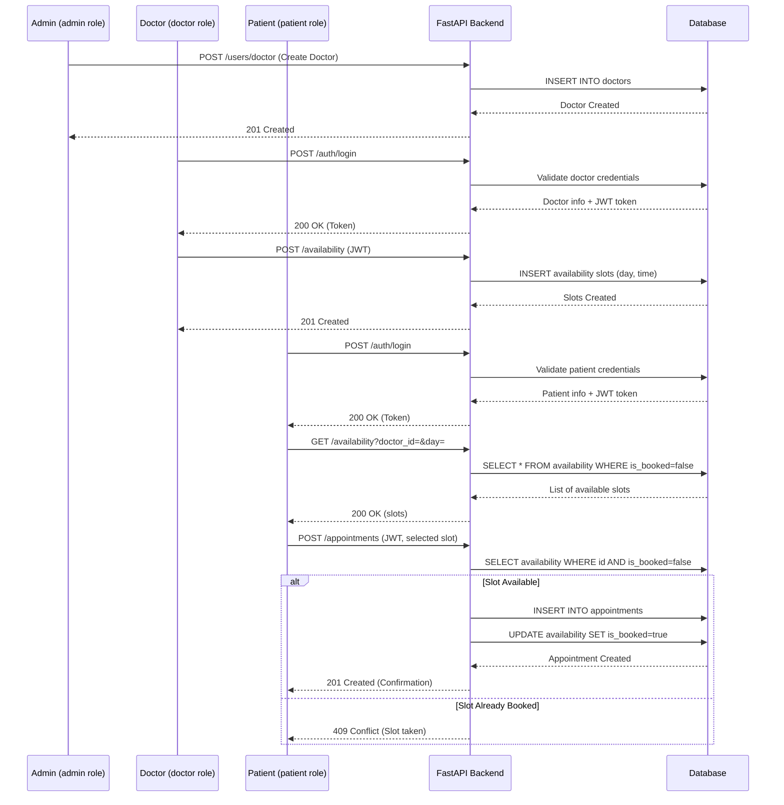
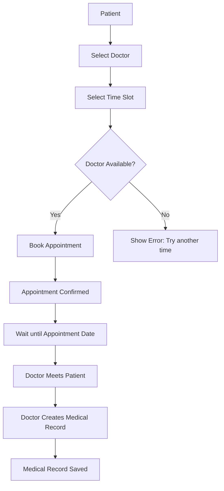
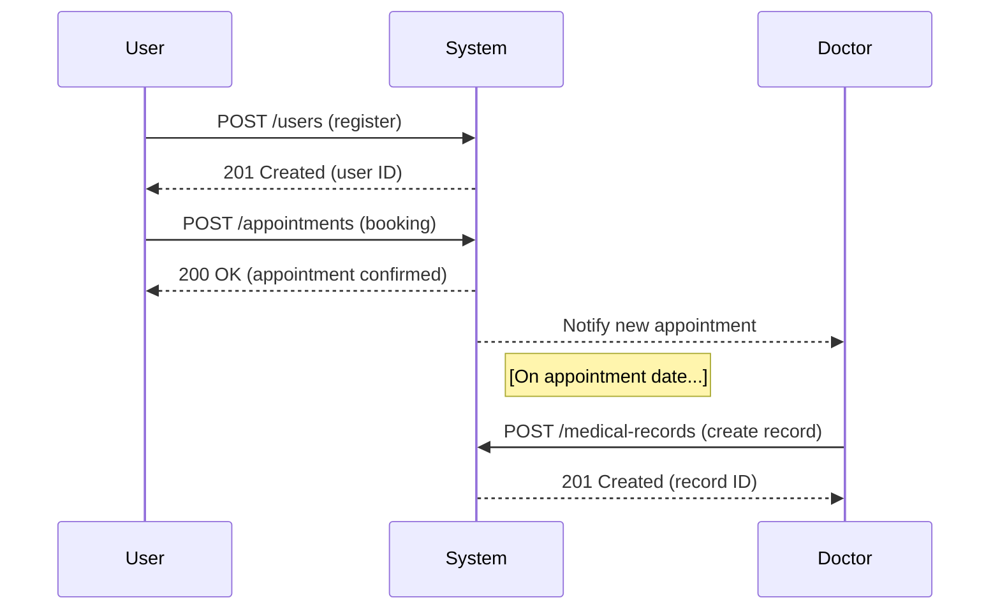
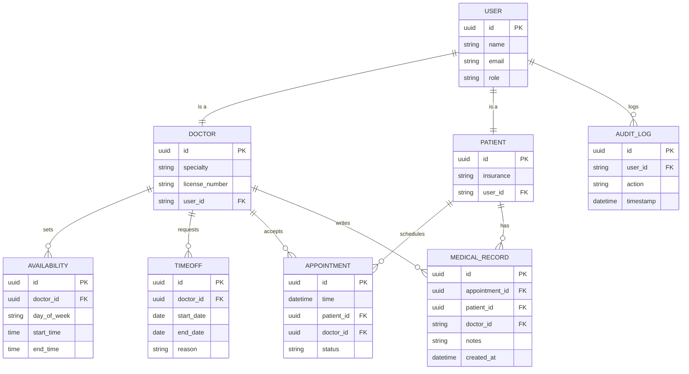

# Appointment APP
### Live link:
- https://fastnestappointment.onrender.com/docs

#### 🔐 Test Credentials

Use the following test accounts to interact with the API during development or testing:

| Role    | Email                 | Password     |
|---------|-----------------------|--------------|
| Admin   | `admin@example.com`   | `admin123`   |
| Doctor  | `doctor@example.com`  | `doctor123`  |
| Patient | `patient@example.com` | `password123`|

> ✅ **Note:** These credentials are for **testing purposes only** and should **not** be used in a production environment.

---


**Appointment APP** is a healthcare scheduling application designed to help clinics manage doctor–patient appointments. It enables patients to register and book available time slots with doctors, tracks doctor availability and time-off, and stores medical records for completed visits.

Key features include:

- **Role-Based User Accounts** (Patients, Doctors, Admins)
- **Doctor Availability & Time-Off Management**
- **Appointment Booking & Scheduling**
- **Medical Records for Patient Visits**
- **Audit Logging of User Actions for Accountability**

---

## 🧑‍⚕️ Role-Based Users
- Patients, doctors, and admin staff
- Fields: `id`, `name`, `email`, `role`, etc.

## 👨‍⚕️ Doctor Profiles
- Doctors have specialties and can set availability or request time-off.

## 📅 Appointment Scheduling
- Patients can view available slots and book an appointment.

## 📋 Medical Records
- After each visit, doctors create records containing notes and diagnosis.

## 📜 Audit Log
- All user actions (e.g. booking, record creation) are logged with timestamps.

---

## 🚀 Installation

To set up the project locally:

### 1. Clone the repository
```


**Appointment APP** is a healthcare scheduling application designed to help clinics manage doctor–patient appointments. It enables patients to register and book available time slots with doctors, tracks doctor availability and time-off, and stores medical records for completed visits.

Key features include:

- **Role-Based User Accounts** (Patients, Doctors, Admins)
- **Doctor Availability & Time-Off Management**
- **Appointment Booking & Scheduling**
- **Medical Records for Patient Visits**
- **Audit Logging of User Actions for Accountability**

---

## 🧑‍⚕️ Role-Based Users
- Patients, doctors, and admin staff
- Fields: `id`, `name`, `email`, `role`, etc.

## 👨‍⚕️ Doctor Profiles
- Doctors have specialties and can set availability or request time-off.

## 📅 Appointment Scheduling
- Patients can view available slots and book an appointment.

## 📋 Medical Records
- After each visit, doctors create records containing notes and diagnosis.

## 📜 Audit Log
- All user actions (e.g. booking, record creation) are logged with timestamps.

---

## 🚀 Installation

To set up the project locally:

### 1. Clone the repository
```bash
git clone https://github.com/okallo/FastNestAppointment.git
cd FastNestAppointment/backend

```

### 2. Create a Python virtual environment
```bash
python -m venv venv
source venv/bin/activate   # On Windows: venv\Scripts\activate
```

### 3. Install dependencies
```bash
pip install -r requirements.txt
```
### 4.Set up the database
```bash
alembic upgrade head
```
### 5.Seed the database(optional)
```bash
python -m app.seed
```

### 5. Run the application
```bash
uvicorn app.main:app --reload
```
---

## 📜 Schemas Overview
#### User
- Fields: id,name,email,hashed_password,role.

#### Doctor
- Fields: id, user_id, specialty, license_number

#### Patient
- Fields: id, user_id, insurance_number, contact_info

#### Appointment
- Fields: id, patient_id, doctor_id, appointment_time, status

#### Availability
- Fields: id, doctor_id, day_of_week, start_time, end_time

#### TimeOff
- Fields: id, doctor_id, start_date, end_date, reason

#### MedicalRecord
- Fields: id, appointment_id, patient_id, doctor_id, notes, created_at

#### AuditLog
- Fields: id, user_id, action, timestamp

### 📡 API Endpoints
#### 🔐 Users
- POST /users/ – Register a new user

- GET /users/{user_id} – Get user details

- PATCH /users/{user_id} – Update user

- DELETE /users/{user_id} – Delete user

#### 👨‍⚕️ Doctors
- POST /doctors/ – Create doctor profile

- GET /doctors/ – List all doctors

- GET /doctors/{doctor_id} – Doctor details

- PATCH /doctors/{doctor_id} – Update doctor

- GET /doctors/{doctor_id}/availability – View availability

- POST /doctors/{doctor_id}/availability – Add availability

#### 🧑 Patients
- POST /patients/ – Create patient profile

- GET /patients/ – List all patients

- GET /patients/{patient_id} – Patient details

- PATCH /patients/{patient_id} – Update patient

#### 📅 Appointments
- POST /appointments/ – Book appointment

- GET /appointments/ – List appointments

- GET /appointments/{appointment_id} – Appointment details

- PATCH /appointments/{appointment_id} – Update appointment

- DELETE /appointments/{appointment_id} – Cancel appointment

#### 📋 Medical Records
- POST /medical-records/ – Create medical record

- GET /medical-records/ – List records

- GET /medical-records/{record_id} – Record details

#### 🗓 Time Off
- POST /doctors/{doctor_id}/time-off – Request time-off

- GET /doctors/{doctor_id}/time-off – View time-off

- DELETE /doctors/{doctor_id}/time-off/{timeoff_id} – Cancel time-off

## 📈 Mermaid Diagrams

### system sequence


### Appointment Booking Flowchart

### User Registration to Medical Record(Sequence)

### Database Schema Diagram

## Notes
- All API endpoints use JSON

